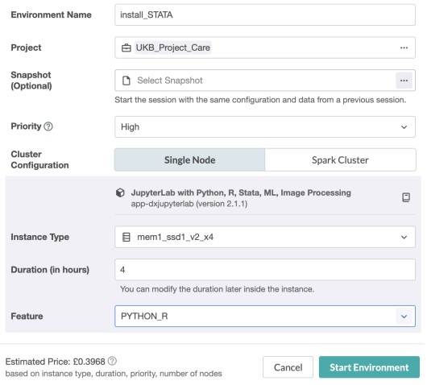
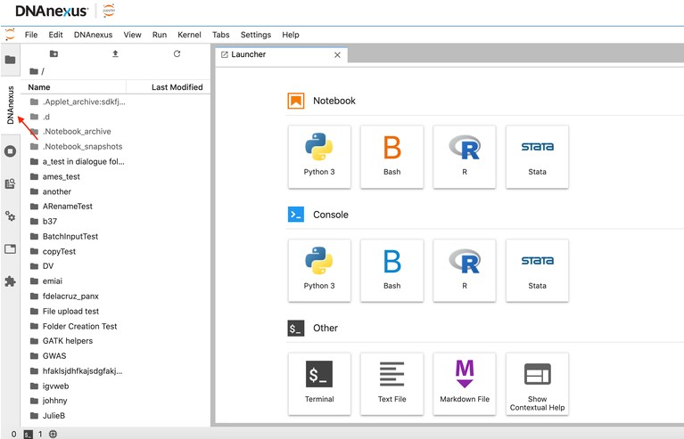

# How to Install Stata 18 on the UKB RAP

Stata can be used on the RAP for analysing UK Biobank data provided you have an active licence. Unfortunately the built-in version of Stata on the RAP is v16, whereas UCL licences are v17+.

The below instructions allow you to install Stata 18 on the RAP and link it to an existing UCL Stata18 licence for use.

## 1. Download Stata to your local machine

Go to https://download.stata.com/download and select "64-bit Stata for Linux on x86-64". This will download a file called "Stata18Linux64.tar.gz" to your computer.

## 2. Upload this file to your UKB-RAP project

This can be done by using the Add > File button within the project.

## 3. Start a JupyterLab Job

Open the below dialogue box by going to Tools > JupyterLab. Rename job to something meaningful (like Install_STATA for example), assign it to your UKB project, and then in the Feature tab, select "PYTHON_R". Click 'Start Environment'. 



## 4. Install Stata

Once inside JupyterLab, open a terminal window and execute the code below in sequence

```
cd usr/local
mkdir stata18
cd stata18
dx download /path/to/Stata18Linux64.tar.gz
tar -xzvf Stata18Linux64.tar.gz
./install                              ## this will be followed by two prompts where you should press y for yes ##
export PATH=/usr/local/stata18:$PATH
./stinit                               ## this also will be followed by two prompts where you should press y for yes ##
```
You will then be prompted to enter the serial number, code, authorization key, and registration details for Stata 18. These can all be found at https://swdb.ucl.ac.uk/ under the 'Downloads' tab on the Stata page.
```
#Enter serial number
#Enter code
#Enter authorisation                   ## this will be followed by two prompts where you should press y for yes ##
#Input First Line Registration         ## as this is a site licence, 'University College London' should go here ##
#Input Second Line Registration   ## this should be 'London', at which point you'll be prompted to press y for yes ##
```
After confirmation that these have been accepted, continue to run the following lines below in sequence.
```
apt update
apt install libtinfo5
apt install libncurses5
pip3 install stata_kernel
python3 -m stata_kernel.install
apt-get install nodejs -y
jupyter labextension install jupyterlab-stata-highlight
rm Stata18Linux.tar.gz
```
## 5. Run the Config File

Copy the file from this repository called 'STATA_config.ipynb' to your project directory and then run within the active notebook.

## 6. Check Stata Successfully Installed

Stata should now be available to run using an icon within the Notebook Launcher



## 7. Save Installation

Click DNAnexus > Create Snapshot to save everything that has been done to the '/.Notebook_snapshots' folder in your project directory. Name something meaningful like 'Stata Installation'.

## 8. How to Access Stata again in future sessions

Open Jupyterlab Notebook as described before in Section 3, except this time select the 'Stata Installation' snapshot file in the optional snapshot box when starting the project. Once the project runs, once again run the 'STATA_config.ipynb' file, and then Stata should be available to run again.


